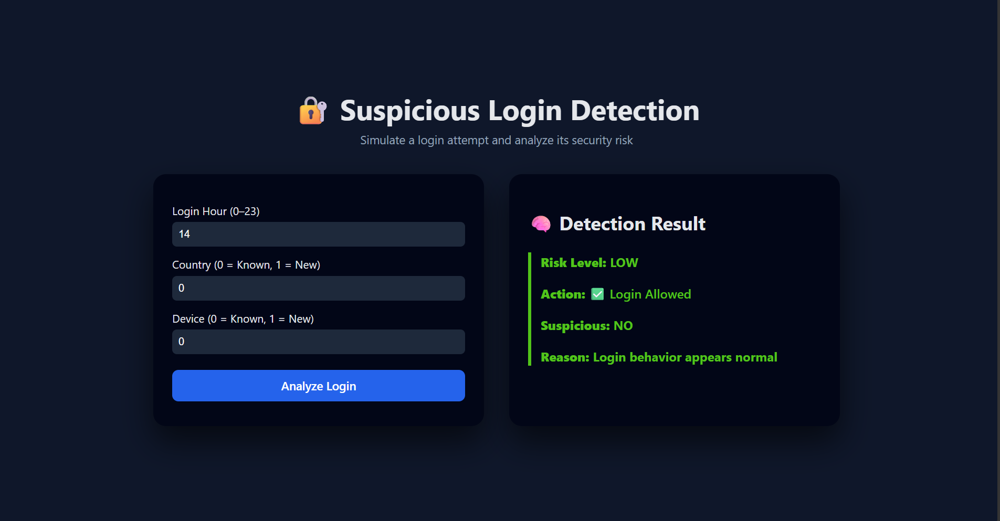
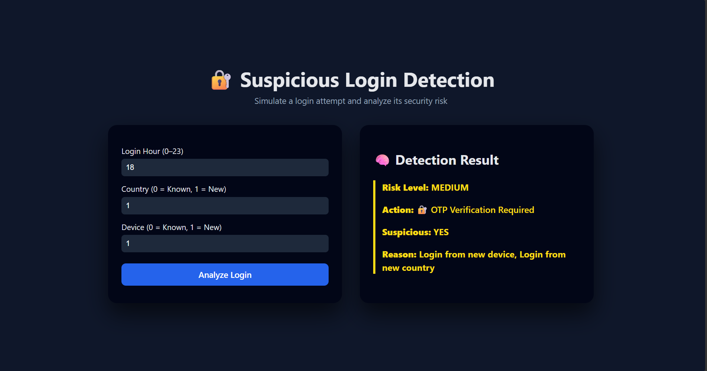
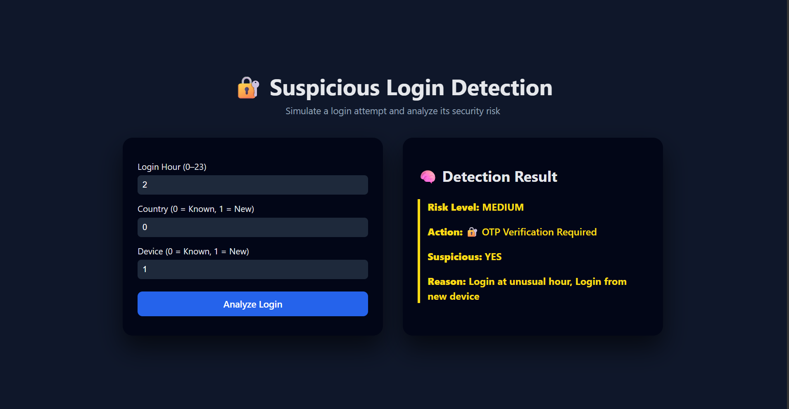
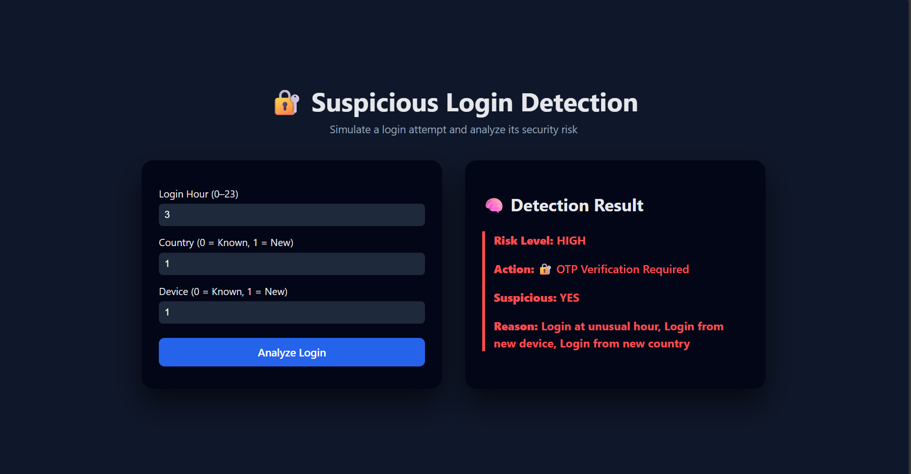
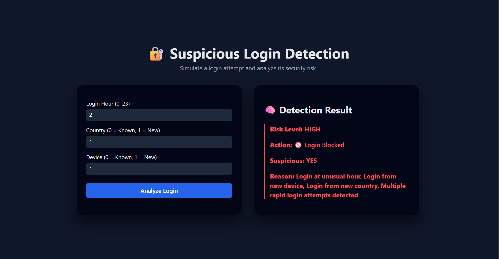
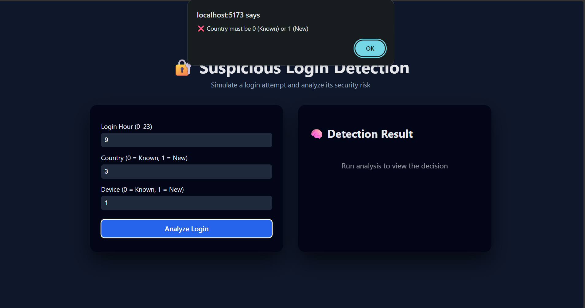

# 🔐 Suspicious Login Detection System

A full-stack security system that simulates and detects suspicious login attempts using **machine learning**, **rule-based security logic**, and **real-time rate limiting**, presented through a **modern React UI**.

---

## 📌 Project Overview

This project analyzes login attempts based on:
- Login time
- Device familiarity
- Country familiarity

Each login attempt is classified into one of three risk levels:
- 🟢 **LOW** – Safe login
- 🟡 **MEDIUM** – Requires OTP verification
- 🔴 **HIGH** – Potential attack (blocked after multiple attempts)

The objective is to **simulate real-world authentication systems** used by banks, SaaS platforms, and enterprise applications.

---

## 🧠 Key Features

- Machine-learning-based risk classification
- Three-level risk model: **LOW / MEDIUM / HIGH**
- Rule-based security overrides for critical patterns
- Redis-backed brute-force attack detection
- Clean FastAPI backend architecture
- React-based frontend with risk-aware UI
- Frontend input validation and defensive UX
- Audit logging for traceability and analysis

---

## 🛠️ Technologies & Tools Used

### Frontend
- React.js
- JavaScript (ES6)
- HTML5
- CSS3 (custom dark theme)
- Fetch API
- Client-side input validation

### Backend
- FastAPI
- Python 3
- Pydantic (data validation)
- Uvicorn (ASGI server)
- CORS Middleware

### Machine Learning
- scikit-learn
- RandomForestClassifier (multi-class)
- Synthetic dataset generation
- Feature engineering
- Model persistence using Joblib

### Data & Storage
- CSV dataset (generated login behavior)
- Redis (Docker-based) for rate limiting
- File-based audit logging

### Development & Infrastructure
- Docker (Redis container)
- Python virtual environment (venv)
- Git & GitHub
- VS Code

---

## 🔄 Project Workflow (Brief)

1. **Dataset Generation**
   - Generated synthetic login data using realistic constraints
   - Labeled data into LOW, MEDIUM, and HIGH risk classes

2. **Model Training**
   - Trained a multi-class Random Forest classifier
   - Evaluated and saved the trained model using Joblib

3. **Backend Integration**
   - Loaded ML model into FastAPI
   - Added rule-based overrides for security-critical cases
   - Implemented Redis-based rate limiting
   - Logged all decisions for audit purposes

4. **Frontend Development**
   - Built a React-based UI for login simulation
   - Implemented risk-based visual indicators
   - Added strict input validation
   - Displayed backend decisions clearly to users

5. **Testing & Validation**
   - Verified LOW, MEDIUM, HIGH, and BLOCK scenarios
   - Tested boundary conditions and invalid inputs

---

## 📸 Screenshots

### 🟢 LOW Risk – Normal Login

### 🟡 MEDIUM Risk – New Device & Country

### 🟡 MEDIUM Risk – Unusual Hour

### 🔴 HIGH Risk – Critical Pattern

### 🚫 BLOCKED – Brute Force Detected

### ⚠️ Input Validation Alert

---

## 📈 Future Enhancements

1. ## OTP verification workflow
2. ## User-specific behavioral profiling
3. ## Admin dashboard for audit logs
4. ## Cloud deployment (AWS / Azure)
5. ## JWT-based authentication
